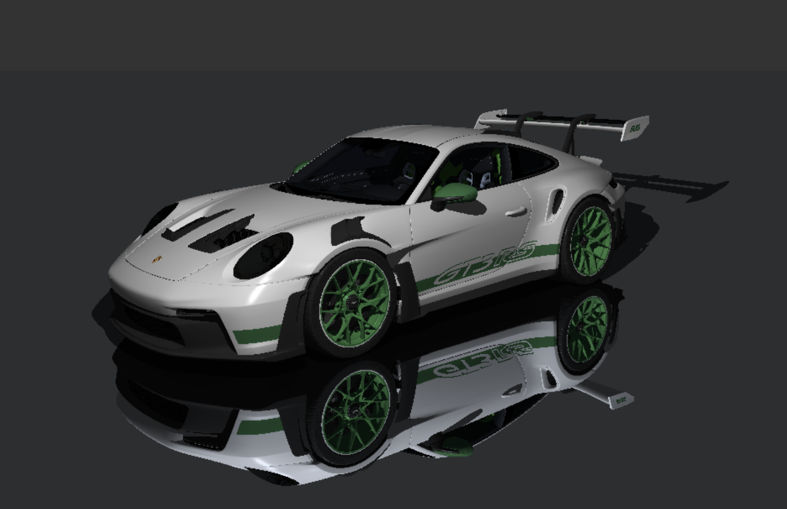

# README
This project is a real-time ray tracing renderer built with WebGPU. The main goal of the project is to render a 3D car model with lighting, shadows, reflections, materials, and texture mapping in real time, using bounding volume hierarchy acceleration to improve the performance of the ray-triangle intersection and WebGPU as the rendering pipeline.


## Get Started
```bash
cd dev
npm run dev
```
Open [http://localhost:5173](http://localhost:5173) in browser.

## Reference
- [Triangle Intersection](https://www.scratchapixel.com/lessons/3d-basic-rendering/ray-tracing-rendering-a-triangle/moller-trumbore-ray-triangle-intersection.html?utm_source=chatgpt.com)
- [WebGPU API](https://developer.mozilla.org/en-US/docs/Web/API/WebGPU_API)
- [WebGPU Tutorial](https://www.bilibili.com/video/BV1BdEQzrEg7/?spm_id_from=333.337.search-card.all.click&vd_source=c4da2760e65f8418e16cf952f49688a2)
- [How to manually read GLTF files](https://wirewhiz.com/read-gltf-files/)
- [Blender Tip: How to use the Decimate Modifier](https://www.youtube.com/watch?v=cwldHToYGt4)
- [BVH in Practice](https://www.youtube.com/watch?v=LAxHQZ8RjQ4)
- [How to compute a 3D Morton number](https://stackoverflow.com/questions/1024754/how-to-compute-a-3d-morton-number-interleave-the-bits-of-3-ints)
- [Ray Tracing vs PathTracing in 6 Games](https://www.youtube.com/watch?v=lixD81ToGcg)
- [Thinking Parallel](https://developer.nvidia.com/blog/thinking-parallel-part-ii-tree-traversal-gpu/)
- [Texture Atlas](https://www.youtube.com/playlist?list=PLMinhigDWz6emRKVkVIEAaePW7vtIkaIF)


## Assets
- Ddiaz Design. "2023 Porsche 911 GT3 RS 2.7 Carrera Tribute 992." Sketchfab, 12 Oct. 2024.  
License: CC Attribution-NonCommercial-ShareAlike (CC BY-NC-SA).
Accessed 19 May 2026.  
https://sketchfab.com/3d-models/2023-porsche-911-gt3-rs-27-carrera-tribute-992-f17a982d5d8a4d97baef4b00b51a4e9a
